# Bayesian Attack Tree Based Cyber-Physical Security Assessment
## Motivation
The advantage of adding modern day information and communication technology (ICT) in the supervisory control and data acquisition (SCADA) system associated with the power network comes at the cost of an increased risk due to cyber
intrusion. A well planned malicious attack on the SCADA system can not only compromise the communication network, but also cause catastrophic effects on the power grid in form of a widespread blackout. In this project, a Bayesian attack tree based approach is used to model cyber attacks in the SCADA network and the associated risk is evaluated as the combined effect on the communication and power system. This avoids the detailed modeling of every component in the CPS and considers only the critical vulnerabilities required to be exploited to perform the attack. Furthermore, the model takes into account the skill level of the adversary and the difficulty in intruding through each type of vulnerability. The proposed cyber attack model is applied on the IEEE-39 bus system with an associated SCADA network. The risk of a cyber attack on the critical vulnerabilities is evaluated for the power system.

## Simple Bayesian Attack Tree Model
An attack graph consists of two types of nodes: exploit to vulnerabilities and conditions required for exploiting. The preconditions needed to exploit a vulnerability are assumed to be either initial conditions of the attack or resulting
output of some previously occurred exploit. In this case, three preconditions are considered to exploit a vulnerability: (i)service, (ii)connection and (iii)privilege required to access the vulnerability from previous exploit.

For example, a cyber intrusion scenario is considered for a control center SCADA system, where an adversary aims to gain unauthorized access to control assets in the power system. The cyber intruder has to access the application server for this purpose which is dedicated to send control commands to open/close circuit breakers in the power system. In order to do so, the adversary needs to gain access of the historian server through a firewall and thereafter reach the application server through a different firewall.
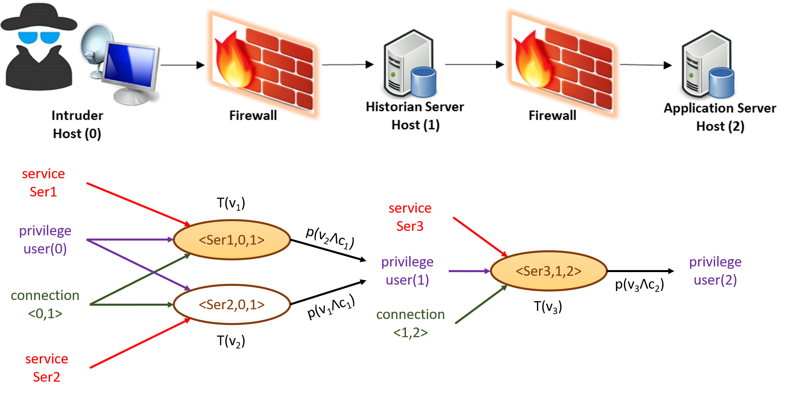

Let there be two possible exploits to the vulnerabilities in the first firewall denoted by <Ser1,0,1> and <Ser2,0,1>. The first one is assumed to be a zero day exploit and the second one is considered as a known exploitation. A zero day exploit to a vulnerability is one which may not be publicly known but identified by an intruder. In order to exploit either of the vulnerabilities, the intruder needs the privilege *user*(0) (which denotes him being present) and is required to be connected to the historian server through <0,1>. Additionally, the vulnerabilities require the services *Ser1*(1) and *Ser2*(1) respectively to be available for them to be exploited. Once the vulnerability is successfully exploited, the intruder gains the user privilege *user*(1) of the historian server. This output of previously occurred exploit can be used as a precondition of the successive exploits. In the second firewall, we consider a single zero-day exploit to a vulnerability denoted by <Ser3,1,2>. This can be successfully exploited by an intruder having privilege *user*(1) to obtain access to the application server.

## Bayesian Attack Tree Models of LAN/SCADA Networks
Substation LAN Model A | Substation LAN Model B 
:---: | :---: 
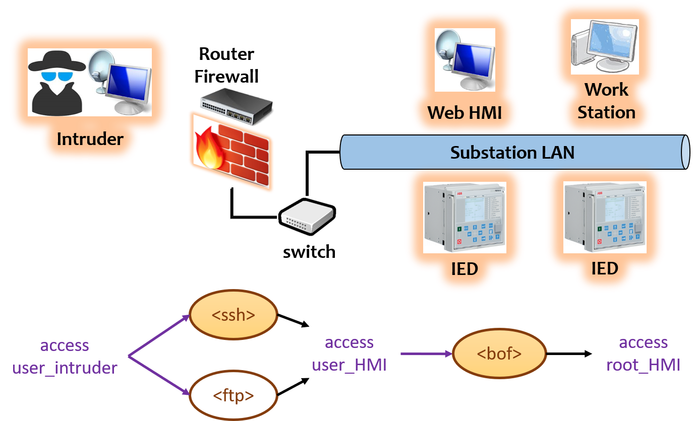 | 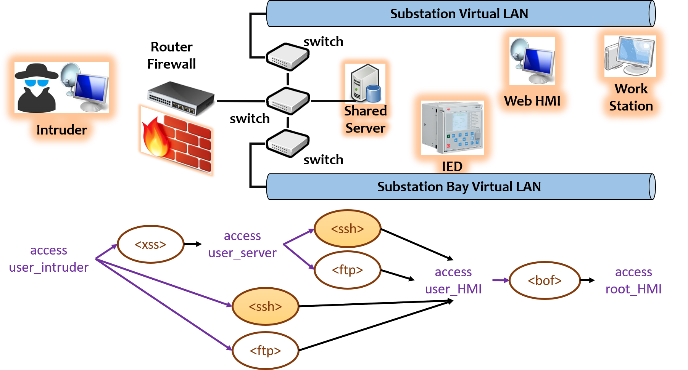

| :--- | :--- 
In this model, the HMI, workstations and the IEDs at a substation are connected to a common LAN network as shown in Fig. 3. A single firewall with an ethernet switch controls the passage of information to and from the network. In this case, the intruder can exploit a vulnerability in the firewall to directly access the HMI which is connected to the LAN network. Two most popularly used protocols for remote access are the file transfer protocol (FTP) and the secure shell (SSH). It is assumed that the FTP vulnerability is a known type and SSH vulnerability is a zero day type. Once the intruder accesses the HMI, a buffer overflow vulnerability (bof) can be exploited to gain administrator privilege on the HMI system. | In this model, the substation LAN is divided into two virtual LANs (VLANs). The substation VLAN connects the workstations, HMI and other control units and the bay VLAN connects the IEDs in the switchyard. These two VLANs communicate with a shared server which alternates between the networks through a pair of ethernet switches. Such an architecture increases the level of security of the SCADA system. An intruder can exploit a vulnerability in the firewall to access the shared server. In this case a known cross scripting vulnerability (XSS) is considered which allows remote attackers to arbitrarily inject web script to access the shared server. Thereafter, the HMI can be accessed by exploiting a vulnerability from the shared server. The remote access of the HMI can be done from the the intruder system directly as in case of model A through the two popularly used protocols FTP and SSH.

Substation LAN Model C | Control Center SCADA Model 
:---: | :---: 
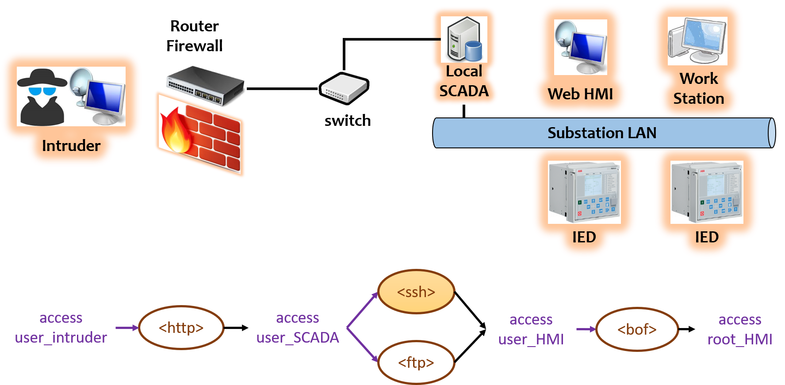 | 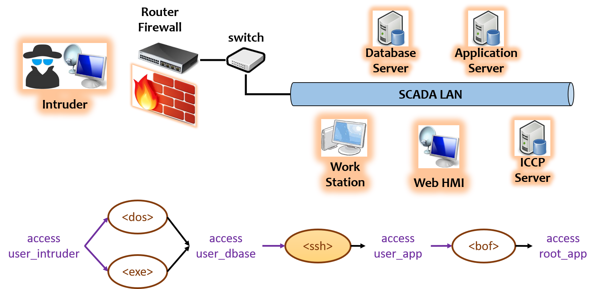

## Mean Time to Compromise
Substation LAN Model A | Substation LAN Model B 
:---: | :---: 
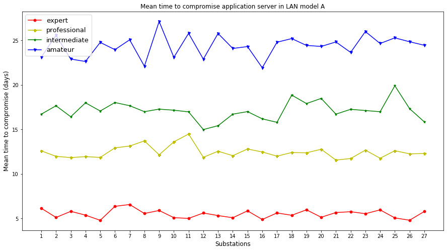 | 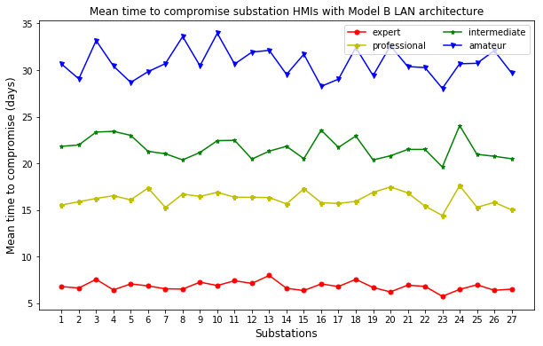

Substation LAN Model C | Control Center SCADA Model 
:---: | :---: 
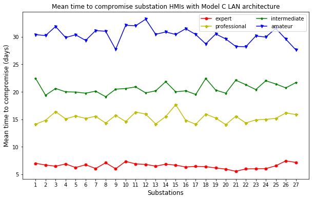 | 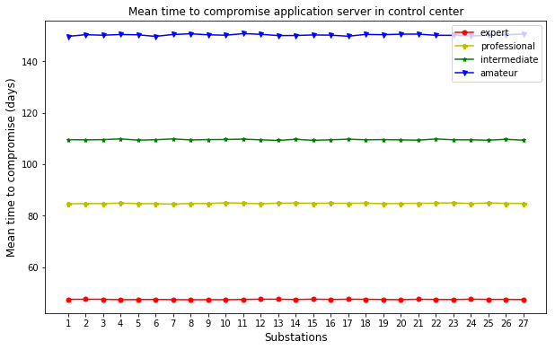

## Security Comparison
Substation LAN Models | Substation LAN Models and SCADA 
:---: | :---: 
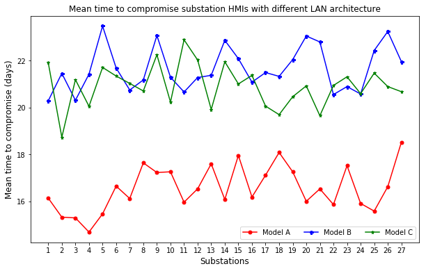 | 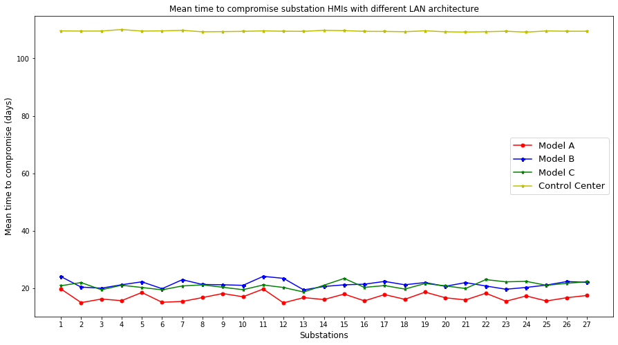

## Physical Impact of an Attack
IEEE 39 bus system | Impact of attack on different IED sets 
:---: | :---: 
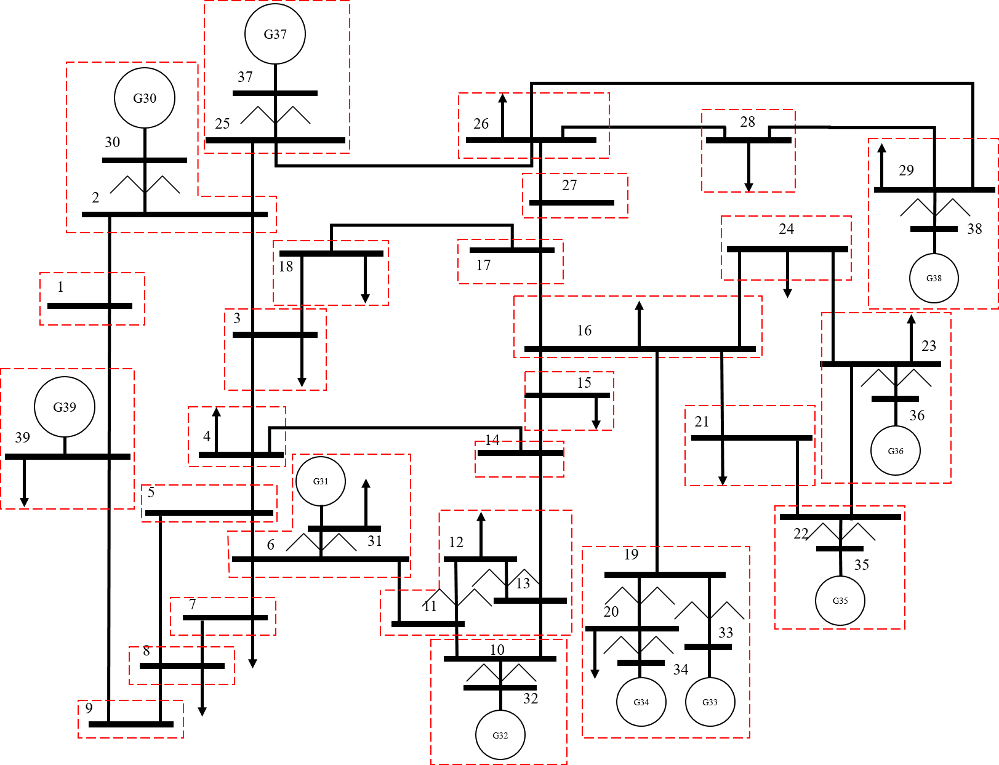 | 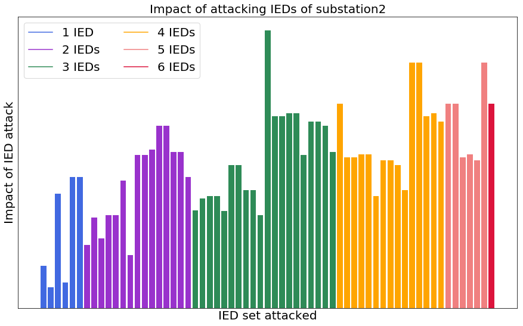 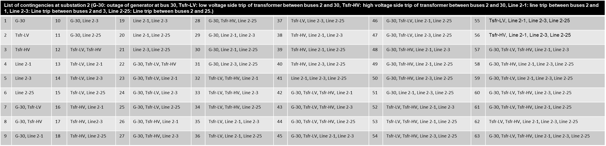

## Risk Assessment
Attack on Substation LAN Models | Attack on Control Center SCADA 
:---: | :---: 
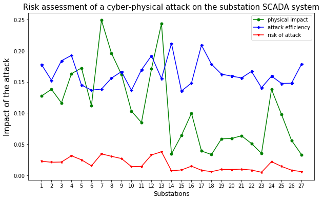 | 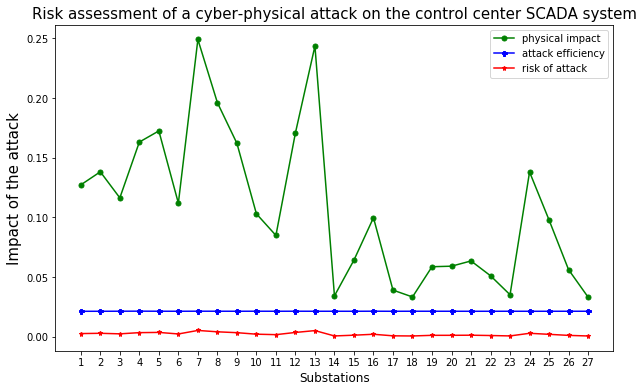